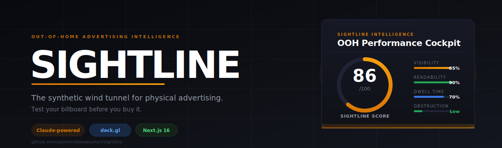

<div align="center">



</div>

---

## What it is

**Sightline** is a fully agentic, end-to-end out-of-home (OOH) advertising pipeline. Give it a company URL — it handles discovery, creative generation, inventory search, placement scoring, and 3D sightline simulation.

What used to take a media agency two weeks now takes two minutes.

---

## The Pipeline

```
  YOUR URL
     │
     ▼
  ① DISCOVER ── AI reads your website, extracts brand identity,
                tone, colors, audience, and value proposition
     │
     ▼
  ② CREATE ─── Generates billboard-ready creatives on the spot:
               copy, layout, visuals — matched to your brand DNA
     │
     ▼
  ③ FIND ────── Searches global OOH inventory across formats
               (billboards, transit, digital, wallscapes)
     │
     ▼
  ④ SCORE ───── Ranks every placement by audience fit,
               foot traffic, sightline quality, and brand alignment
     │
     ▼
  ⑤ SIMULATE ── Low-poly pedestrians and drivers move through a
               live 3D city — you watch real sightlines in motion
     │
     ▼
  ⑥ ACTIVATE ── Export a ready-to-execute media brief: placement
               specs, creative files, scoring rationale, next steps
```

---

## Tech Stack

| Layer | Technology |
|---|---|
| Framework | Next.js 16 (App Router, Turbopack), React 19 |
| 3D / WebGL | deck.gl 9, Three.js 0.184, Mapbox GL 3 |
| AI | LLM vision + generation, Managed Agents orchestration |
| Styling | Tailwind CSS 4 |
| Data | OpenStreetMap Overpass API, ai4animation motion-capture |
| Language | TypeScript 5 (strict) |

---

## Getting Started

### Prerequisites

- Node.js 20+
- [Mapbox](https://mapbox.com) API token (free tier works)
- AI API key

### Quickstart

```bash
git clone https://github.com/jasonmatthewsuhari/emergency.git
cd emergency && npm install
```

```bash
# .env.local
NEXT_PUBLIC_MAPBOX_TOKEN=pk.your_token_here
ANTHROPIC_API_KEY=sk-ant-your_key_here
NEXT_PUBLIC_GOOGLE_MAPS_API_KEY=your_key_here
```

```bash
npm run dev
# → http://localhost:3000
```

---

## Market Context

| | |
|---|---|
| U.S. OOH market (2024) | $9.46B |
| Digital OOH growth rate | +10.5% YoY |
| Global OOH market | $50B+ |
| Avg. agency brief-to-placement timeline | 2–4 weeks |
| Sightline brief-to-plan timeline | **~2 minutes** |
| Existing end-to-end OOH automation tools | **zero** |

---

## What's Next

- [ ] Direct vendor booking from winning placements (programmatic DOOH)
- [ ] Real foot traffic data from mobility APIs (replacing simulation)
- [ ] Video creative generation and analysis
- [ ] Multi-market campaign orchestration
- [ ] AR preview mode — place your billboard in your phone's camera

---

## License

MIT — see [LICENSE](LICENSE).

---

<div align="center">

_"Brief it. Simulate it. Ship it."_

</div>
